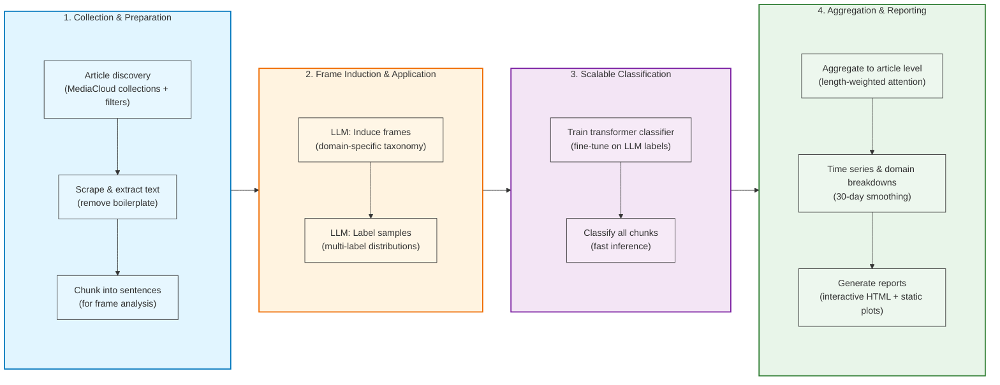

# Narrative Framing for **Air Pollution**, **Energy Transition**, **Animal Welfare**

TL;DR: I identify and track a set of narrative framings across media articles on different topics using LLMs and other NLP techniques. This helps see how issues are discussed, detect trends and shifts, surface outlets/journalists to prioritize, inform advocacy and potentially gauge intermediate impact.

  This post is part of a series of technical explorations for <strong>Effective Advocacy</strong>. The ultimate goal is to devise practical tools that help advocacy teams understand narratives, map strategic actors, and track changes (and ideally impact) over time.

## Why narrative framing?
Narrative framing analysis can serve multiple purposes:
- Understand how a topic is discussed: what narratives, causes, and emphases appear—and how they change over time.
- Inform advocacy: detect momentum, measure campaign impact, and identify outlets/journalists to prioritize.
- Go beyond keywords: capture paraphrase and implied meaning when language varies across outlets and time.

## Method overview

The pipeline follows a hybrid LLM-to-classifier approach: we start with flexible LLM exploration to discover and annotate narrative frames, then scale up with a fine-tuned transformer classifier. This balances domain adaptability (frames tailored to each question and context) with computational efficiency (fast inference over large corpora).

**Data collection and preparation**: We query MediaCloud collections with topical filters to discover relevant articles, scrape full text, extract main content (removing boilerplate), and chunk into sentences or short spans for analysis.

**Frame discovery and labeling**: An LLM proposes a compact set of narrative frames tailored to the specific question (e.g., "What are the causes of air pollution discussed in Jakarta?"), creating a domain-specific taxonomy. We then use the LLM to carefully label a diverse sample of chunks with frame distributions (multi-label), capturing ambiguous cases and providing training data.

**Scalable classification**: We fine-tune a multi-label transformer classifier (language-appropriate, e.g., IndoBERT for Indonesian) on the LLM-labeled samples, then use it to classify all chunks across the corpus. This gives us consistent, fast inference while preserving the frame schema defined by induction.

**Aggregation and reporting**: Chunk-level predictions are aggregated to article-level profiles using length-weighted attention, then rolled up into time series (daily values, 30-day smoothed) and domain-level breakdowns. Reports combine interactive HTML for exploration with static visualizations for versioning and embedding.

## Results

### Jakarta — Air pollution causes

**Context**: Analysis of 2020–2025 Indonesian media coverage on air pollution in Jakarta, focusing on how different causes are discussed. The corpus spans 14,469 articles from major Indonesian outlets, capturing how journalists frame pollution sources—from vehicle emissions to seasonal weather patterns. This run demonstrates how narrative framing captures semantic nuance: for instance, construction-related pollution is frequently discussed alongside transportation (road dust, infrastructure development) even when explicit "construction dust" terminology is absent.

**Frame share over time** (30‑day running average):

**Results summary**: Transport emissions dominate coverage (41.1% of articles), reflecting Jakarta's heavy traffic and vehicle-related pollution discourse. Natural and meteorological factors appear in 8.5% of articles, with notable seasonal spikes during dry periods when weather conditions exacerbate pollution. The framing reveals how media connects pollution to both immediate sources (vehicles, industry) and contextual factors (seasonal weather, urban development).

**Frames identified**:

| Frame | Description | Key Keywords | Share |
|-------|-------------|--------------|-------|
| **Transport Emissions** | Vehicle emissions from cars, motorcycles, buses, trucks, and road traffic | kendaraan bermotor, lalu lintas, emisi kendaraan, uji emisi | 41.1% |
| **Natural Factors** | Meteorological and seasonal factors affecting air quality (weather patterns, El Niño, rainfall) | cuaca, angin, musim kemarau, El Nino, curah hujan rendah | 8.5% |
| **Industrial Emissions** | Factory and manufacturing emissions, including smelters, steel, and cement production | pabrik, industri, smelter, industri baja, industri semen | 6.3% |
| **Power Plant Emissions** | Coal-fired and fossil-fuel power plant emissions | PLTU, pembangkit listrik, coal-fired power plant | 3.3% |
| **Biomass Burning** | Agricultural fires, forest fires, and land clearing through burning | pembakaran lahan, kebakaran hutan, pembakaran biomassa | 2.1% |
| **Waste Burning** | Open burning of municipal waste and landfill fires | pembakaran sampah, open burning, landfill fire | 1.9% |
| **Household Emissions** | Household cooking and heating using fossil fuels or biomass | pembakaran rumah tangga, kompor kayu, bahan bakar padat | 0.5% |
| **Construction Dust** | Construction activities, roadworks, and resuspended dust | debu konstruksi, pembangunan, road dust, pekerjaan jalan | 0.4% |

*Note: Percentages represent the share of articles that discuss each frame (occurrence-based, threshold ≥0.2). Articles can discuss multiple frames.*

### Philippines — Renewable energy

<!-- To be added -->

### Brazil — Animal welfare

<!-- To be added -->

## Technical details / Supplementary information

### Article discovery (search/filters)
We start by defining the slice of media we care about in a way that is both broad enough to catch variation and precise enough to be actionable. Using Media Cloud collections lets us anchor each run in a country and time window, and then layer topical filters (for instance, city names or issue cues) to focus coverage. The intent is to bias toward recall at this stage: we would rather include a few borderline articles and filter them downstream than miss legitimate phrasing that differs from our initial keywords. Every run is captured in a small YAML file so the choices are explicit and replicable.

### Scrape and extract
To reason about narratives we need full passages, not just headlines or snippets. We fetch pages and extract the main text, then remove boilerplate and navigation tails that otherwise drown the signal (things like widgets, “follow us” blocks, or stock tickers). The trimming rules live in config so we can adapt them by outlet or country. This step trades a little engineering effort for cleaner inputs and more stable downstream classification.

### Frame induction (LLM)
Instead of hard‑coding a universal taxonomy, we ask an LLM to propose a compact set of categories tailored to the question and context (e.g., causes of air pollution in Jakarta). This keeps the schema close to how journalists actually talk in that domain and time, while our induction prompt nudges toward empirically grounded, measurable categories. We snapshot the resulting schema (names, short definitions, examples) and treat it as a contract for the rest of the run—minimizing drift and keeping the analysis auditable.

### Frame application to samples (LLM)
We then use the LLM as a careful, probabilistic annotator on a sample of passages. Each passage gets a distribution over frames (not just a single label) plus a brief rationale. This does two things: it reveals ambiguous cases that keywords would miss, and it gives us enough labeled data to train a supervised model. Sampling is deliberate—we prefer a diverse, representative set rather than trying to label everything with the LLM, which would be costly and less reproducible.

### Supervised classifier (transformers)
For scale and consistency, we fine‑tune a multi‑label transformer classifier on those LLM‑labeled passages. This gives us cheap, fast inference over tens of thousands of chunks while freezing the labeling policy defined by the schema. We pick language‑appropriate encoders (e.g., IndoBERT for Indonesian), and use sigmoid outputs with a threshold to allow overlapping frames when passages truly mix narratives. The trade‑off is classic: the classifier is less flexible than an LLM but more stable, cheaper, and easier to validate with held‑out metrics.

### Classify the corpus
We classify content at the chunk level (typically sentences or short spans) to avoid burying weaker frames in long articles. Light keyword gating and regex excludes from earlier steps help keep us on topic without reintroducing brittle rules. Results are cached per document to support iterative runs and easy re‑aggregation.

### Aggregate and report
Finally, we move from chunk‑level predictions to article‑level profiles and summaries over time. A length‑weighted aggregator estimates how much attention each frame receives within an article; an occurrence view answers a different question—what share of articles mention a frame at all. We build daily time series and smooth them over 30 days to make seasonal shifts legible, and we break out top domains to see who emphasizes what. Reports are exported as interactive HTML (for exploration) and as static PNGs (for embedding and versioning).

### Models used (at a glance)
- Induction + application (LLM): OpenAI GPT‑4 class models configured per run (e.g., `gpt-4.1` for induction; `gpt-4.1-mini` for application). See run config: `configs/narrative_framing/*`.
- Classifier: Hugging Face transformers sequence classifier (BERT‑family encoder) trained for multi‑label classification with sigmoid outputs. Model is configurable; e.g., Indonesian runs use `indobenchmark/indobert-base-p1`.
- Embeddings (when needed): Sentence‑Transformers encoders (e.g., `all-MiniLM-L6-v2`) via `efi_analyser/embedders/sentence_transformer_embedder.py`.
