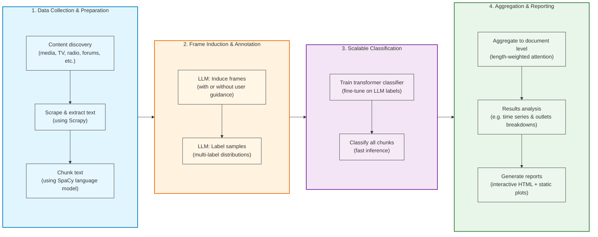

# Narrative Framing for **Air Pollution** and **Animal Welfare**

I prototyped a method to identify and track narrative framings across various corpora (e.g. news articles, TV news, radio programs, forums). The ambition is to support effective advocacy in their strategy and impact monitoring, through better understanding how issues are discussed, detecting trends and shifts and surfacing outlets/journalists to prioritize.

This post includes two illustrative examples: one on air pollution in Indonesia and one on animal welfare in Canada.

  This post is part of a series of technical explorations for <strong>Effective Advocacy</strong>. The goal is to devise practical tools that help advocacy better inform their strategy and measure their impact. Anticipated applications include narrative framing analysis, strategic actors mapping, and key findings dissemination tracking.

## Why narrative framing analysis?
Part of the motivation behind this series comes from a long-standing discomfort with the phrase “shaping the narrative” often found in Theories of Change. The concept is seductive but slippery — it risks turning advocacy into a chase for mentions, mistaking visibility for influence. Still, I wondered whether I was being unfair. Maybe narrative change can be a legitimate pathway to impact — but only if we can observe and measure it rigorously.

That curiosity led me to treat narrative framing as a Monitoring, Evaluation, and Learning (MEL) challenge: could we track how the stories around an issue evolve, and whether advocacy efforts actually move them? But it quickly became more than a measurement problem. If we can map how narratives differ across regions or outlets, that same information could guide prioritization and strategy — revealing where certain framings already align with desired change, and where gaps in discourse might signal opportunities for leverage.

Narrative framing analysis can serve several complementary purposes across advocacy and philanthropy. Rather than treating it as a media-monitoring tool, I see it as a way to make collective meaning formation visible and measurable — to understand how public conversations evolve, who shapes them, and where interventions might matter most.

  

- **Understand how a topic is being discussed**: Every issue carries multiple possible stories: who is responsible, who suffers, and what counts as a solution. A framing analysis helps reveal which of these stories dominate, and which remain marginal or absent. It could matter because public narratives can influence which kinds of solutions receive attention or legitimacy (caveat: I haven't look at the evidence on the connection between framing and policy outcomes). For example, if air pollution coverage in Jakarta overemphasizes individual behavior while neglecting industrial and energy sources, it signals not just a bias in media attention but a structural blind spot in public debate.

- **Prioritise regions, messaging and outlets**: Comparing how narratives differ across outlets or regions can reveal where certain perspectives are missing — or, conversely, where the conversation already aligns with desired change. This information could eventually help advocates or funders decide where to focus their attention: in some cases by addressing narrative gaps, and in others by building on more conducive framings.

- **Measure change over time**: Tracking how narratives evolve — across repeated studies or advocacy campaigns — could help observe whether certain framings gain or lose prominence. This might support both strategic reflection (for advocates seeking feedback on their efforts) and broader research on how public conversations shift around key issues.

To see what this might look like in practice, I ran two small experiments. One asks how Indonesian media talk about air pollution — who gets blamed, and who doesn’t. The other looks at how Canadian outlets frame meat and animal welfare. They’re not polished studies, but sketches of what it could mean to treat narratives themselves as objects of measurement and reflection.

## Example 1: Air pollution causes in Jakarta, Indonesia

In this first exploration, I looked at how Indonesian media discuss air pollution in Jakarta, particularly which **sources of pollution** are mentioned. Such application could be used for instance to highlight any discrepancy between the overal weight of sources in media framing and their actual contribution to air pollution as estimated by source apportionment studies, and in turn inform research and communication strategies.

Leveraging MediaCloud and scraping scripts, I collected around 15,000 media articles published between January 2020 and October 2025 that mention air pollution in Jakarta. Most were written in Bahasa Indonesia.

  

    
Varying attention to the air pollution in Jakarta

    
Number of articles per day - 30-day window average

  

  <iframe src="{{ site.baseurl }}/assets/narrative_framing/indonesia_airpollution/article_volume_over_time.html" style="width: 100%; height: 450px; border: none;"></iframe>
  

    <strong>Data Source:</strong> Articles are collected from MediaCloud collection "Indonesia - National" using the keywords: "air pollution" OR "air quality" OR "polusi udara" OR "kualitas udara". Articles are further filtered to include only those mentioning Jakarta, DKI, ibukota, or jabodetabek.
  

To analyse this corpus, I implemented a six-step process: chunking, frame induction, frame annotation, model training, classification and aggregation (for more details, see [Methodology section below](#method-overview)).

First, each article was split into smaller, coherent segments called **chunks** (about 200 words) using linguistic models. This helps capture multiple frames coexisting within a single document while keeping each segment short enough for the models (both the annotator and the classifier) to interpret reliably.

Next comes the **frame induction** where I use an LLM to identify the main frames that appear across a sample of chunks. The idea is to let the model look across hundreds of short passages and propose a compact set of recurring ways the issue is discussed. This can be done with little or no guidance (letting the model discover patterns freely) or with light direction around a specific question. In this case, I guided it toward sources of air pollution, which resulted in eight frames. The model then generated short descriptions, examples, and keywords for each, forming the schema used in the next steps.

  

    
Frames used for classifying air pollution sources in Indonesian media

    
Definitions for each frame category as determined in model induction and applied in this analysis

  



    <strong>Note:</strong> These frames and their definitions were generated by an LLM-based "frame inducer," which generated names, examples, keywords and semantic cues for each frame. The inducer was provided with a sample of 200 passages from the dataset and guided with plain-text instructions focusing on identifying distinct air pollution sources.
  

Once the frames were defined, I used a lighter language model (GPT-4.1-mini) to **annotate** a few thousand text segments according to those categories. These labelled examples then served to **train** a BERT-based classifier (IndoBERT in this case) that could scale the analysis to the full corpus. In the final step, each chunk was **classified** according to the likelihood of each frame and then aggregated by article, year, or outlet, weighting by text length to estimate how much attention each framing received over time.

The results are shown in the figure below. Transport emissions dominate coverage reflecting Jakarta's heavy traffic and vehicle-related pollution discourse. Natural and meteorological factors come next.

  

    
How Indonesian media frames the sources of the capital's pollution

    
This chart shows the sources of air pollution mentioned in media articles about air pollution in Jakarta or the greater metropolitan area. The analysis is based on articles published between 2020 and 2025 in Indonesian media, weighted by content length.

  

  <iframe src="{{ site.baseurl }}/assets/narrative_framing/indonesia_airpollution/yearly_weighted_wz.html" style="width: 100%; height: 500px; border: none;"></iframe>
  

    <strong>Note:</strong> The analysis identifies air pollution sources through natural language processing of Indonesian media articles. Articles are included if they mention Jakarta, DKI, ibukota, or jabodetabek and contain keywords related to air pollution. Each source category (vehicles, industry, forest fires, etc.) is identified through frame classification of article content. The chart shows the relative frequency of mentions for each pollution source across all analyzed articles, weighted by article length to reflect the prominence of each frame in the coverage.
      
    <strong>Data Sources:</strong> The list of articles is retrieved from MediaCloud. Content has been scraped and processed locally for analysis.
      
    <strong>Disclaimer:</strong> These results are for demonstration purposes only. The analysis should not be relied upon to provide accurate estimates of media framing trends. Further validation and methodological refinement are needed before these results can be used for research or policy purposes.
  

### Media outlets breakdown

The analysis can also reveal how different media outlets frame air pollution sources. Some outlets emphasize certain pollution sources more than others, which could potentially inform advocacy targeting and messaging strategies.

  

    
Frame distribution across media outlets

    
Share of each pollution source frame by media outlet, weighted by content length

  

  
  

    <strong>Disclaimer:</strong> These results are for demonstration purposes only. The analysis should not be relied upon to provide accurate estimates of media framing trends. Further validation and methodological refinement are needed before these results can be used for research or policy purposes.
  

## Example 2: Animal welfare in Canada

To test how adaptable the method is, I applied it to a very different topic: how Canadian media discuss meat production and consumption. The framing categories were developed with the animal welfare movement in mind, aiming to capture dimensions that might be strategically relevant (such as factory farming, animal suffering, plant-based alternatives, environmental impacts, health effects, and epidemic risks). This was a first attempt, made with limited experience in that field, but intended to explore what such an analysis could reveal about the narrative landscape around meat.

As in the previous example, the first step was frame induction — using a language model to identify the main ways the issue is discussed. In this case, I provided explicit guidance to focus on angles most relevant to animal welfare advocacy: factory farming, animal suffering, plant-based alternatives, environmental impacts, health effects, and epidemic risks. The model then proposed six corresponding frames, generating short descriptions, examples, and semantic clues for each.

  

    
Frames used for classifying meat coverage in Canadian media

    
Definitions for each frame category as determined in model induction and applied in this analysis

  

  
  

    <strong>Note:</strong> These frames and their definitions were generated by an LLM-based "frame inducer," which generated names, examples, keywords and semantic cues for each frame. The inducer was provided with a sample of 200 passages from the dataset and guided with plain-text instructions focusing on identifying distinct angles of meat coverage in Canadian media.
  

After defining these frames, I used a smaller model (GPT-4.1-mini) to annotate a few thousand text segments according to them, and then fine-tuned a BERT-based classifier (DistilBERT) to scale the analysis to the full corpus. Each chunk was then classified based on the likelihood of each frame and aggregated across articles, domains and years. The goal here wasn’t to produce precise statistics, but to see whether this workflow could surface meaningful patterns in how meat and animal welfare are discussed over time.

The results are shown in the figure below. I’ll leave it to animal welfare advocates to judge whether any interesting signal emerges from this first run. I imagine it could be interesting to compare such patterns across countries as well.

  

    
How Canadian media frames meat production and consumption

    
This chart shows the frames mentioned in media articles about meat in Canada. The analysis is based on articles published between 2020 and 2021 in Canadian media (English and French), weighted by content length.

  

  <iframe src="{{ site.baseurl }}/assets/narrative_framing/canada_meat/yearly_weighted_wz.html" style="width: 100%; height: 500px; border: none;"></iframe>
  

    <strong>Note:</strong> The analysis identifies meat-related frames through natural language processing of Canadian media articles. Articles are included if they contain keywords related to meat ("meat" in English or "viande" in French). Each frame category (factory farming, animal suffering, plant-based alternatives, etc.) is identified through frame classification of article content. The chart shows the relative frequency of mentions for each frame across all analyzed articles, weighted by article length to reflect the prominence of each frame in the coverage.
      
    <strong>Data Sources:</strong> The list of articles is retrieved from MediaCloud collection "Canada - National". Content has been scraped and processed locally for analysis.
      
    <strong>Disclaimer:</strong> These results are for demonstration purposes only. The analysis should not be relied upon to provide accurate estimates of media framing trends. Further validation and methodological refinement are needed before these results can be used for research or policy purposes.
  

For brevity, I haven’t included the time-series plots or the language- and domain-level aggregations here, but I’d be happy to share them if they’re of interest.

## Looking ahead
These early experiments only scratch the surface of what narrative analysis could do for advocacy and research. Going forward, several directions seem worth exploring:

- **Other mediums**: both examples have focused on media articles, but the same approach could be extended to TV and radio transcripts, online forums, or social media (though with associated API costs).

- **Valence and stance**: Understanding how issues are discussed matters as much as whether they are mentioned. Adding sentiment or stance detection could help distinguish between supportive, neutral, and dismissive framings.

- **Conditional framing**: Beyond tracking which frames appear, future work could look at how they co-occur/

- **Validation and reliability**: These are exploratory prototypes. Proper validation would probably require some manual annotation and validation, better uncertainty evaluation as well as better checks against overfitting.

## Get in touch
I am interested in hearing from others working on similar problems or exploring how these tools could be applied in new contexts or further developed to be more useful. Whether you have ideas for improvements, questions about the approach, or want to collaborate on applications, I'd love to hear from you - [reach out to me](mailto:hubert.thieriot@gmail.com).

## Method overview

The pipeline follows a hybrid LLM-to-classifier approach: we start with flexible LLM exploration to discover and annotate narrative frames, then scale up with a fine-tuned transformer classifier. This balances domain adaptability (frames tailored to each question and context) with computational efficiency (fast inference over large corpora).

**Content discovery (search/filters)**:
We start by defining the slice of content we care about—whether from media articles, TV news transcripts, radio programs, forums, Reddit, or other sources—in a way that is both broad enough to catch variation and precise enough to be actionable. For media analysis, using Media Cloud collections lets us anchor each run in a country and time window, and then layer topical filters (for instance, city names or issue cues) to focus coverage. Similar approaches work for other platforms: TV news and radio transcripts, forum posts, Reddit threads, or other text corpora can be collected through their respective APIs or scraping tools. The intent is to bias toward recall at this stage: we would rather include a few borderline documents and filter them downstream than miss legitimate phrasing that differs from our initial keywords. Every run is captured in a small YAML file so the choices are explicit and replicable.

**Scrape and extract**:
To reason about narratives we need full passages, not just headlines or snippets. We fetch pages and extract the main text, then remove boilerplate and navigation tails that otherwise drown the signal (things like widgets, "follow us" blocks, or stock tickers). The trimming rules live in config so we can adapt them by outlet or country. This step trades a little engineering effort for cleaner inputs and more stable downstream classification.

**Chunking**:
We split documents into smaller chunks (~200 words) using spaCy language models. This linguistic approach respects sentence boundaries, paragraph structure, and discourse connectors (words like "however" or "therefore" that should stay attached to their preceding sentences). We use language-specific spaCy models (e.g., `en_core_web_sm` for English, `id_core_news_sm` for Bahasa Indonesia) to ensure proper sentence segmentation and preserve semantic coherence.

Chunking and annotating at this granularity is essential because long documents often contain multiple frames, and classifying at the document level would bury weaker or less prominent frames. By working with smaller units, we can detect when a single article discusses both vehicle emissions and industrial pollution, even if one frame dominates the overall document.

**Frame induction (LLM)**:
We ask an LLM to propose a compact set of categories tailored to the question and context (e.g., causes of air pollution in Jakarta) by feeding it a random sample of passages (200 passages in the examples above) in several consecutive batches, followed by a consolidation call. User can inject guidance to guide the LLM e.g. to include or exclude certain frames. After a manual and shallow comparison of various models performances through visual inspection of framing results, I selected OpenAI GPT‑4.1 for this step. The resulting schema (names, short definitions, examples, keywords) is passed along to the annotation step.

**Frame application to samples (LLM)**:
We then use another LLM as a probabilistic annotator on a sample of passages (typically 2,000 passages in the examples above). Each passage gets a distribution over frames (not just a single label) plus a brief rationale. We typically use a smaller GPT‑4 variant (e.g., `gpt-4.1-mini`) for this step to balance cost and quality, since we need to label thousands of examples. This does two things: it reveals ambiguous cases that keyword-based approaches would mis-label, and it gives us enough labeled data to train a supervised model.

**Supervised classifier (transformers)**:
We then fine‑tune a multi‑label transformer classifier on those LLM‑labeled passages using Hugging Face transformers. We start with a pre-trained language model (e.g., `indobenchmark/indobert-base-p1` for Bahasa Indonesia, `distilbert-base-uncased` for English) and adapt it to our frame classification task: the encoder layers learn to recognize frame-relevant patterns, while a new classification head outputs probability scores for each frame using sigmoid activation. This gives us cheap, fast inference over tens of thousands of chunks while freezing the labeling policy defined by the schema.

**Classify the corpus**:
We classify content at the chunk level (typically sentences or short spans) to avoid burying weaker frames in long documents. Light keyword gating and regex excludes from earlier steps help keep us on topic without reintroducing brittle rules. Results are cached per document to support iterative runs and easy re‑aggregation.

**Aggregate and report**:
Finally, we aggregate chunk‑level predictions to document‑level profiles and summaries over time. A length‑weighted aggregator estimates how much attention each frame receives within a document (article, post, thread, etc.); an occurrence view answers a different question—what share of documents mention a frame at all.

  <strong>Why not simply use keywords?</strong>
  
  
Keyword-based approaches have significant limitations for narrative analysis:

  
  <ul>
    <li><strong>Paraphrases and semantic variations</strong>: Journalists describe the same concept in many ways. An article discussing "road dust resuspension from heavy traffic" contains the same frame as one mentioning "vehicle emissions," but keyword matching would miss this connection.</li>
    
    <li><strong>Language evolution</strong>: Terms change over time and across regions. What counts as "construction pollution" in Jakarta might be discussed as "infrastructure development impacts" elsewhere, requiring constant keyword list updates.</li>
    
    <li><strong>Implied meaning</strong>: Media often conveys frames through context rather than explicit terms. A passage describing "stagnant air during the dry season" implies natural factors affecting pollution, even without using keywords like "El Niño" or "low rainfall."</li>
    
    <li><strong>Cross-language nuance</strong>: In multilingual contexts, keywords must be translated carefully, but semantic understanding captures equivalent concepts across languages automatically.</li>
  </ul>
  
  
Our approach uses LLMs to capture semantic meaning, then scales it with a classifier—combining the flexibility of language understanding with the efficiency needed for large-scale analysis.

---

